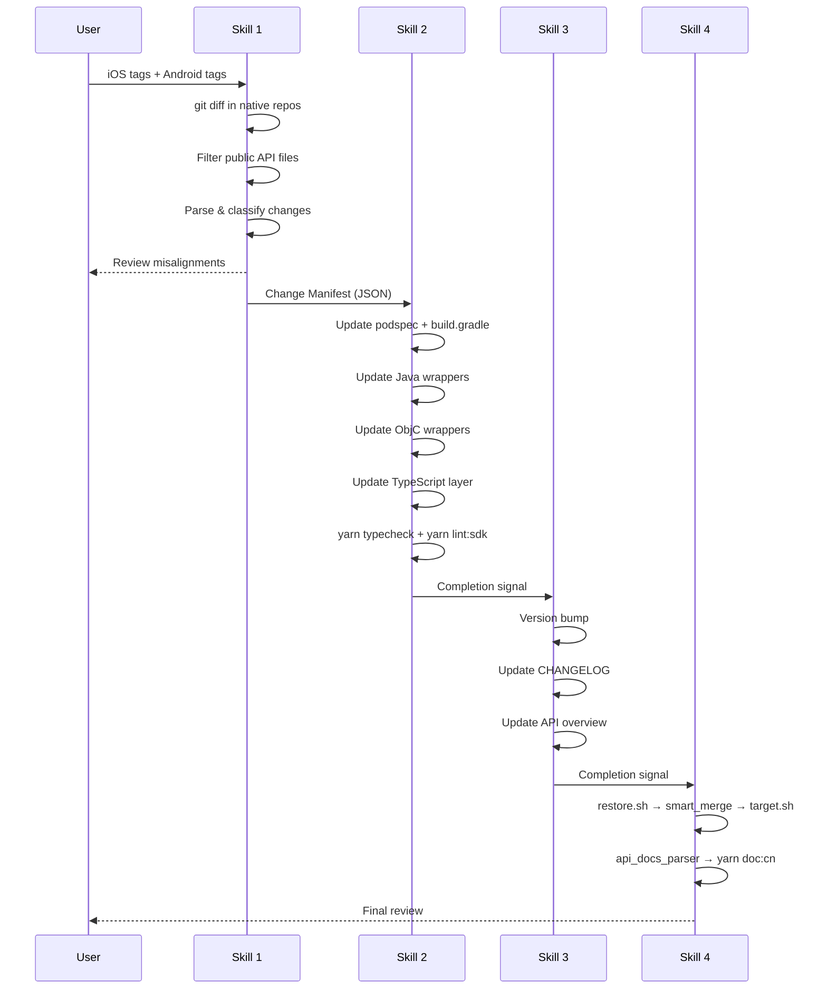

# Design Document: SDK Upgrade Skills

## Overview

本设计描述一套 4 个 Kiro Skills（放置在 `.kiro/skills/` 目录），用于自动化 React Native Chat SDK 在底层 HyphenateChat Native SDK 升级时的同步更新流程。

系统采用流水线架构：每个 Skill 是一个独立的 Markdown 指令文档，Kiro 按顺序执行。Skill 之间通过结构化的 **Change Manifest**（JSON 格式）传递数据。

**设计目标：**
- 将重复性高、创造性低的升级工作自动化
- 保持人工介入点用于需要判断的决策
- 确保不破坏项目结构（保护 `lib/`、`src/version.ts`、`modules/cpp/`、`modules/*/flutter/`）

## Architecture

### 整体流水线


### 数据流



### Skill 文件结构

```
.kiro/skills/
├── 01-get-native-change-manifest.md
├── 02-core-upgrade.md
├── 03-update-docs-and-version.md
└── 04-generate-chinese-api-docs.md
```

每个 Skill 文件是一个 Markdown 文档，包含：
- **触发条件**：何时使用此 Skill
- **输入参数**：用户需要提供的信息
- **执行步骤**：Kiro 需要执行的具体操作
- **输出**：Skill 产出的结果
- **人工介入点**：需要用户决策的地方

## Components and Interfaces

### Skill 1: Get Native Change Manifest (`01-get-native-change-manifest.md`)

**输入参数：**
- `ios_old_tag`: iOS 旧版本 Tag（格式：`x.y.z`，如 `4.16.0`）
- `ios_new_tag`: iOS 新版本 Tag（格式：`x.y.z`，如 `4.17.0`）
- `android_old_tag`: Android 旧版本 Tag（格式：`SDK_x.y.z`，如 `SDK_4.16.2`）
- `android_new_tag`: Android 新版本 Tag（格式：`SDK_x.y.z`，如 `SDK_4.17.0`）

**算法/伪代码：**

```
1. 验证 Tag 格式
   - iOS: /^\d+\.\d+\.\d+$/
   - Android: /^SDK_\d+\.\d+(\.\d+)*$/
   - 格式错误则报告并终止

2. 获取 iOS diff
   cd /Users/asterisk/Codes/easemob/emclient-ios
   git diff <ios_old_tag>..<ios_new_tag> --name-only
   → 过滤文件路径：
     INCLUDE: newSDK/HyphenateSDK/**/*.h
     EXCLUDE: *+Private.h, *+Category.h
   → 对每个通过过滤的文件：
     git diff <ios_old_tag>..<ios_new_tag> -- <file_path>
     解析 diff 内容，提取：
     - 新增方法声明（+ 开头，匹配 ObjC 方法签名）
     - 删除方法声明（- 开头）
     - 修改的方法签名（参数变化）
     - @deprecated 标记
     - 新增 delegate/protocol 方法

3. 获取 Android diff
   cd /Users/asterisk/Codes/easemob/emclient-android
   git diff <android_old_tag>..<android_new_tag> --name-only
   → 过滤文件路径：
     INCLUDE: hyphenatechatsdk/src/com/hyphenate/chat/EM*.java
     EXCLUDE: EMA*.java (adapter classes)
     EXCLUDE: adapter/, core/ subdirectories
     EXCLUDE: 内部类列表 (EMSmartHeartBeat, EMHeartBeatReceiver, etc.)
   → 对每个通过过滤的文件：
     git diff <android_old_tag>..<android_new_tag> -- <file_path>
     解析 diff 内容，提取：
     - 新增 public 方法
     - 删除 public 方法
     - 修改的方法签名
     - @Deprecated 注解
     - 新增 listener/callback 接口方法

4. 对齐分析
   - 将 iOS 和 Android 的变更按 API 语义名称匹配
   - 标记对齐的变更（两端都有对应）
   - 标记不对齐的变更（仅一端有）→ 人工决策点

5. 生成 Change Manifest JSON
   - 输出到工作目录或直接传递给下一个 Skill
```

**iOS 文件过滤规则：**
```
path.startsWith("newSDK/HyphenateSDK/")
  && path.endsWith(".h")
  && !path.endsWith("+Private.h")
  && !path.endsWith("+Category.h")
```

**Android 文件过滤规则：**
```
path.startsWith("hyphenatechatsdk/src/com/hyphenate/chat/")
  && path.matches("EM[^A].*\\.java$")  // EM*.java but not EMA*.java
  && !path.contains("/adapter/")
  && !path.contains("/core/")
  && !INTERNAL_CLASSES.includes(basename(path))

INTERNAL_CLASSES = [
  "EMSmartHeartBeat.java", "EMHeartBeatReceiver.java",
  "EMMonitorReceiver.java", "EMJobService.java",
  "EMChatService.java", "EMEncryptProvider.java",
  "EMEncryptUtils.java", "EMCollector.java", "EMBase.java"
]
```

**人工介入点：**
- iOS/Android 变更不对齐时，展示差异表格，等待用户决定：
  - 跳过（仅单端实现）
  - 包含（RN 层仍需支持）
  - 延后（下个版本处理）

**输出：** Change Manifest JSON（见 Data Models 节）

---

### Skill 2: Core Upgrade (`02-core-upgrade.md`)

**输入参数：**
- Change Manifest（来自 Skill 1）
- `ios_sdk_version`: 新的 iOS SDK 版本号（如 `4.17.0`）
- `android_sdk_version`: 新的 Android SDK 版本号（如 `4.17.1`）

**算法/伪代码：**

```
1. 更新版本依赖
   - podspec: 修改 s.dependency 'HyphenateChat','~> X.Y.Z'
   - build.gradle: 修改 implementation 'com.hyphenate:...:X.Y.Z'

2. 遍历 Change Manifest 中的每个变更项：

   FOR EACH change IN manifest.changes:
     SWITCH change.type:

       CASE "new_api":
         a. Java 层：
            - ExtSdkMethodType.java: 添加 public static final String
            - ExtSdk{Domain}Wrapper.java: 添加方法实现
            - ExtSdkHelper.java: 添加 JSON 转换（如有新类型）
         b. ObjC 层：
            - ExtSdkMethodTypeObjc.h: 添加 static NSString 常量
            - ExtSdkMethodTypeObjc.m: 添加枚举映射
            - ExtSdk{Domain}Wrapper.m: 添加方法实现
            - ExtSdkToJson.h/.m: 添加 JSON 转换（如有新类型）
            - ExtSdkApiObjcRN.mm: 注册事件名（如为监听器）
         c. TypeScript 层：
            - Consts.ts: 添加 export const MT{name} = '{name}';
            - Chat{Domain}Manager.ts: 添加公开方法
            - ChatEvents.ts: 添加监听器接口方法（如为监听器）
            - src/common/Chat*.ts: 添加类型定义（如有新类型）
            - src/index.ts: 添加导出（如有新公开类型）

       CASE "deprecated_api":
         a. Java: 添加 @Deprecated 注解，保留实现
         b. ObjC: 添加 deprecated 注释
         c. TypeScript: 添加 @deprecated JSDoc，保留实现

       CASE "renamed_api":
         a. 等同于 deprecated_api(旧名) + new_api(新名)
         b. 在旧方法中添加指向新方法的说明

       CASE "param_change":
         a. 修改对应 wrapper 方法的参数列表
         b. 修改 TypeScript 方法签名
         c. 更新 JSON 转换逻辑

       CASE "new_listener":
         a. 同 new_api，额外在 ExtSdkApiObjcRN.mm 注册事件
         b. TypeScript: ChatEvents.ts 添加接口方法

3. 验证
   yarn typecheck  → 类型检查通过
   yarn lint:sdk   → 代码规范通过
```

**文件修改映射表：**

| Change Manifest 字段 | Java 文件 | ObjC 文件 | TypeScript 文件 |
|---|---|---|---|
| new_api (method) | ExtSdkMethodType + Wrapper | MethodTypeObjc.h/.m + Wrapper.m | Consts.ts + Manager.ts |
| new_api (type) | ExtSdkHelper.java | ExtSdkToJson.h/.m | common/Chat*.ts + index.ts |
| new_listener | ExtSdkMethodType + Wrapper | MethodTypeObjc + Wrapper + ApiObjcRN.mm | Consts.ts + ChatEvents.ts + Manager.ts |
| deprecated_api | @Deprecated on method | deprecated comment | @deprecated JSDoc |
| param_change | Wrapper method params | Wrapper method params | Manager method signature |

**保护规则（硬约束）：**
- 不修改 `modules/cpp/` 下任何文件
- 不修改 `modules/*/flutter/` 下任何文件
- 不修改 `lib/` 目录
- 不修改 `src/version.ts`
- 不在 wrapper 层新增文件（如需新增，暂停并提示用户）

**人工介入点：**
- 需要新增 wrapper 文件时
- 类型转换逻辑复杂无法自动推断时
- `yarn typecheck` 或 `yarn lint:sdk` 失败时

---

### Skill 3: Update Docs and Version (`03-update-docs-and-version.md`)

**输入参数：**
- `upgrade_type`: `"bugfix"` | `"feature"`
- `changelog_en`: 英文更新日志内容
- `changelog_zh`: 中文更新日志内容
- Change Manifest（用于生成 API overview 更新）

**算法/伪代码：**

```
1. 版本号计算
   current_version = read package.json → version
   IF upgrade_type == "bugfix":
     new_version = bump_patch(current_version)  // x.y.Z+1
   ELSE IF upgrade_type == "feature":
     new_version = bump_minor(current_version)  // x.Y+1.0

2. 更新 package.json
   - version: new_version
   - scripts.doc:cn:update: 替换版本参数为 new_version

3. 更新 CHANGELOG.md
   - 在文件顶部（标题之后）插入新条目：
     ## [new_version] - YYYY-MM-DD
     ### Added
     - ...
     ### Deprecated
     - ...
     ### Changed
     - ...

4. 更新 CHANGELOG.zh.md
   - 同上，使用中文内容

5. 更新 docs/rn_api_overview.md
   - 对于新增 API：添加方法行到对应 Manager 表格
   - 对于废弃 API：标记为 deprecated
   - API 注释从 native 源码头文件/JavaDoc 获取
```

**版本号递增规则：**
```
bump_patch("1.15.0") → "1.15.1"
bump_patch("1.15.1-beta.0") → "1.15.1"  // 去除 prerelease
bump_minor("1.15.1") → "1.16.0"
bump_minor("1.15.1-beta.0") → "1.16.0"
```

---

### Skill 4: Generate Chinese API Docs (`04-generate-chinese-api-docs.md`)

**前置条件：** Skill 2 和 Skill 3 已完成

**算法/伪代码：**

```
1. 同步英文源码到中文项目
   cd /Users/asterisk/Codes/zuoyu/react-native-chat-sdk-cn
   bash restore.sh
   // 效果：rn72/src/ → cn/src/

2. 智能合并（保留中文注释）
   cd /Users/asterisk/Codes/zuoyu/react-native-chat-sdk-cn
   python smart_merge_v5.py src
   // 效果：对于既有中文又有英文的注释块，移除英文保留中文
   //       新增/纯英文的注释块保留英文待翻译

3. 补充新增 API 的中文注释
   // 人工介入点：
   // - 检查 smart_merge 后仍为英文的新增 API 注释
   // - 从 iOS/Android native 源码获取中文注释
   // - 或由 agent 辅助翻译

4. 覆盖回 RN SDK 项目
   cd /Users/asterisk/Codes/zuoyu/react-native-chat-sdk-cn
   bash target.sh
   // 效果：cn/src/ → rn72/src/

5. 生成中文 API Overview
   cd /Users/asterisk/Codes/zuoyu/api_docs_parser
   yarn start
   // 输出：output.md（原始）、output2.md（排序后）
   // 将 output2.md 内容替换到 rn72/docs/rn_api_overview.zh.md 第 14 行起
   // 保留前 13 行固定头部

6. 生成最终中文 API 文档
   cd /Users/asterisk/Codes/rn/react-native-chat-sdk-rn72
   yarn doc:cn
   // 输出：docs/build/cn/ 目录
```

**人工介入点：**
- 步骤 3：新增 API 的中文注释需要人工补充或确认翻译质量
- 步骤 5：确认 output2.md 内容正确后再替换

**关键约束：**
- 执行顺序严格：1→2→3→4→5→6，不可跳步
- `api_docs_parser/index.js` 的 `targetDir` 已指向 rn72 的 `src/`
- 步骤 4 执行后 rn72 的 `src/` 中注释变为中文版本

## Data Models

### Change Manifest（核心数据模型）

Skill 1 输出、Skill 2 输入的结构化数据：

```typescript
interface ChangeManifest {
  metadata: {
    generated_at: string;          // ISO 8601 timestamp
    ios_old_tag: string;           // e.g. "4.16.0"
    ios_new_tag: string;           // e.g. "4.17.0"
    android_old_tag: string;       // e.g. "SDK_4.16.2"
    android_new_tag: string;       // e.g. "SDK_4.17.0"
  };
  changes: ChangeItem[];
  misalignments: MisalignmentItem[];
}

interface ChangeItem {
  id: string;                      // unique identifier, e.g. "chatmanager_sendMessage"
  type: ChangeType;
  domain: ManagerDomain;           // which manager this belongs to
  method_name: string;             // RN method name (camelCase)
  ios: PlatformChange | null;      // null if iOS doesn't have this change
  android: PlatformChange | null;  // null if Android doesn't have this change
  description: string;             // human-readable description
  is_listener: boolean;            // true if this is a listener/event callback
}

type ChangeType =
  | "new_api"
  | "deprecated_api"
  | "renamed_api"
  | "param_change"
  | "new_listener";

type ManagerDomain =
  | "client"
  | "chat"
  | "group"
  | "contact"
  | "room"
  | "push"
  | "presence"
  | "thread"
  | "userinfo"
  | "conversation";

interface PlatformChange {
  file_path: string;               // relative path in native repo
  method_signature: string;        // original method signature
  params: ParamInfo[];
  return_type: string;
  doc_comment: string;             // extracted documentation
}

interface ParamInfo {
  name: string;
  type: string;
  is_optional: boolean;
  default_value?: string;
}

interface MisalignmentItem {
  description: string;
  ios_only: ChangeItem[];          // changes only in iOS
  android_only: ChangeItem[];      // changes only in Android
  resolution?: "skip" | "include" | "defer";  // user decision
}
```

### Tag 格式验证

```typescript
// iOS tag: x.y.z (纯数字版本号)
const IOS_TAG_REGEX = /^\d+\.\d+\.\d+$/;

// Android tag: SDK_x.y.z[.w] (带 SDK_ 前缀，可能有第四位)
const ANDROID_TAG_REGEX = /^SDK_\d+\.\d+\.\d+(\.\d+)*$/;
```

### 版本号模型

```typescript
interface SemVer {
  major: number;
  minor: number;
  patch: number;
  prerelease?: string;  // e.g. "beta.0"
}

function bumpPatch(v: SemVer): SemVer {
  return { major: v.major, minor: v.minor, patch: v.patch + 1 };
}

function bumpMinor(v: SemVer): SemVer {
  return { major: v.major, minor: v.minor + 1, patch: 0 };
}
```

### 方法名常量映射

三处常量必须保持同步：

| TypeScript (`Consts.ts`) | Java (`ExtSdkMethodType.java`) | ObjC (`ExtSdkMethodTypeObjc.h`) |
|---|---|---|
| `export const MTsomeMethod = 'someMethod';` | `public static final String someMethod = "someMethod";` | `static NSString *_Nonnull const ExtSdkMethodKeySomeMethod = @"someMethod";` |

命名规则：
- 方法名值（字符串）三端完全一致
- TypeScript 常量名：`MT` + PascalCase 方法名
- Java 常量名：camelCase 方法名
- ObjC 常量名：`ExtSdkMethodKey` + PascalCase 方法名

## Correctness Properties

*A property is a characteristic or behavior that should hold true across all valid executions of a system — essentially, a formal statement about what the system should do. Properties serve as the bridge between human-readable specifications and machine-verifiable correctness guarantees.*

### Property 1: iOS File Path Filter Correctness

*For any* file path string, the iOS filter function SHALL return `true` if and only if the path starts with `newSDK/HyphenateSDK/`, ends with `.h`, does not end with `+Private.h`, and does not end with `+Category.h`.

**Validates: Requirements 1.3**

### Property 2: Android File Path Filter Correctness

*For any* file path string, the Android filter function SHALL return `true` if and only if the path starts with `hyphenatechatsdk/src/com/hyphenate/chat/`, matches `EM[^A]*.java` pattern, does not contain `/adapter/` or `/core/` subdirectories, and the filename is not in the internal classes exclusion list.

**Validates: Requirements 1.4, 1.7**

### Property 3: Change Manifest Structure Validity

*For any* valid git diff output from the native repos, the generated Change Manifest SHALL always contain the required `metadata`, `changes`, and `misalignments` fields, and every item in `changes` SHALL have a valid `type` from the set `{new_api, deprecated_api, renamed_api, param_change, new_listener}` and a valid `domain`.

**Validates: Requirements 1.5**

### Property 4: Platform Misalignment Detection

*For any* pair of iOS and Android change sets, if a change exists in one platform but has no semantic match in the other, it SHALL appear in the `misalignments` array. Conversely, if a change has a semantic match on both platforms, it SHALL NOT appear in `misalignments`.

**Validates: Requirements 1.6**

### Property 5: Protected Paths Invariant

*For any* execution of Skills 1-4, the files in `lib/`, `src/version.ts`, `modules/cpp/`, and `modules/*/flutter/` SHALL remain unmodified (byte-identical before and after execution).

**Validates: Requirements 2.11, 2.12, 3.7, 3.8, 6.1, 6.2, 6.3, 6.4**

### Property 6: Version Increment Correctness

*For any* valid semver version string and upgrade type, `bumpPatch` SHALL increment only the patch component (Z+1) and `bumpMinor` SHALL increment the minor component (Y+1) and reset patch to 0, both stripping any prerelease suffix.

**Validates: Requirements 4.1, 4.2**

### Property 7: Tag Format Validation

*For any* input string, the iOS tag validator SHALL accept it if and only if it matches the pattern `^\d+\.\d+\.\d+$`, and the Android tag validator SHALL accept it if and only if it matches the pattern `^SDK_\d+\.\d+\.\d+(\.\d+)*$`.

**Validates: Requirements 6.5, 6.6**

## Error Handling

### Tag 验证错误

| 错误场景 | 处理方式 |
|---|---|
| iOS Tag 格式不匹配 `x.y.z` | 报告错误，显示期望格式和实际输入，终止 Skill 1 |
| Android Tag 格式不匹配 `SDK_x.y.z` | 报告错误，显示期望格式和实际输入，终止 Skill 1 |
| Tag 在仓库中不存在 | 执行 `git tag -l` 列出可用 tag，提示用户选择 |

### Git 操作错误

| 错误场景 | 处理方式 |
|---|---|
| 仓库路径不存在 | 报告路径错误，提示用户确认项目路径 |
| `git diff` 执行失败 | 显示 git 错误信息，检查仓库状态 |
| 工作区有未提交变更 | 警告用户，建议先 stash 或 commit |

### 代码生成错误

| 错误场景 | 处理方式 |
|---|---|
| `yarn typecheck` 失败 | 显示类型错误，暂停让用户/agent 修复 |
| `yarn lint:sdk` 失败 | 显示 lint 错误，尝试 `--fix`，仍失败则暂停 |
| 需要新增 wrapper 文件 | 暂停执行，展示原因，等待用户确认 |
| JSON 转换逻辑无法自动推断 | 暂停执行，展示 native 类型定义，请求用户指导 |

### 文档生成错误

| 错误场景 | 处理方式 |
|---|---|
| `smart_merge_v5.py` 执行失败 | 显示 Python 错误，检查 venv 环境 |
| `api_docs_parser` 执行失败 | 显示错误，检查 node 环境和 targetDir 配置 |
| `yarn doc:cn` 失败 | 显示 typedoc 错误，通常是 TypeScript 编译问题 |
| `rn_api_overview.zh.md` 行数不足 13 行 | 报告文件结构异常，暂停 |

### 通用错误处理策略

1. **可恢复错误**：自动重试一次，仍失败则暂停并报告
2. **不可恢复错误**：立即暂停，展示错误详情和可选方案
3. **歧义/冲突**：暂停执行，展示具体问题，提供选项让用户决策
4. **每个 Skill 完成后**：输出执行摘要（修改的文件列表、变更内容概要）

## Testing Strategy

### 测试方法概述

由于本系统的核心产出是 Kiro Skill 文件（Markdown 指令文档），测试策略分为两层：

1. **可提取的纯逻辑函数** — 适合 property-based testing
2. **端到端 Skill 执行** — 适合 integration testing

### Property-Based Testing（纯逻辑层）

以下逻辑可以提取为独立的 TypeScript 工具函数并进行 property-based testing：

**测试框架：** [fast-check](https://github.com/dubzzz/fast-check)（TypeScript PBT 库）
**最低迭代次数：** 100 次/property

| Property | 测试目标 | 生成器策略 |
|---|---|---|
| Property 1: iOS Filter | `filterIosPath(path)` | 生成随机路径字符串，包含各种边界情况 |
| Property 2: Android Filter | `filterAndroidPath(path)` | 生成随机路径字符串，包含 EM/EMA 前缀变体 |
| Property 3: Manifest Structure | `parseToManifest(diff)` | 生成模拟 diff 输出 |
| Property 4: Misalignment | `detectMisalignment(ios, android)` | 生成随机变更集对 |
| Property 6: Version Bump | `bumpVersion(ver, type)` | 生成随机 semver 字符串 |
| Property 7: Tag Validation | `validateTag(tag, platform)` | 生成随机字符串 |

**Tag 格式：**
- Feature: sdk-upgrade-skills, Property 1: iOS file path filter correctness
- Feature: sdk-upgrade-skills, Property 2: Android file path filter correctness
- Feature: sdk-upgrade-skills, Property 6: Version increment correctness
- Feature: sdk-upgrade-skills, Property 7: Tag format validation

### Integration Testing（端到端层）

| 测试场景 | 验证方式 |
|---|---|
| Skill 1 完整执行 | 使用已知 tag 对（如 4.16.0→4.17.0），验证输出 manifest 包含预期变更 |
| Skill 2 完整执行 | 使用固定 manifest，验证所有目标文件被正确修改 |
| Skill 3 版本更新 | 验证 package.json、CHANGELOG 被正确更新 |
| Skill 4 文档生成 | 验证 restore→merge→target→generate 流程产出正确文件 |
| Protected paths | 执行任意 Skill 后，验证保护目录未被修改 |

### 验证命令

每次 Skill 2 执行后必须通过：
```bash
yarn typecheck    # TypeScript 类型检查
yarn lint:sdk     # ESLint 代码规范检查
```

### 工具函数位置

可测试的纯逻辑函数建议放在：
```
.kiro/skills/__utils__/
├── filter.ts          # iOS/Android 文件路径过滤
├── version.ts         # 版本号计算
├── tag-validator.ts   # Tag 格式验证
└── manifest.ts        # Change Manifest 解析和验证
```

这些工具函数既服务于 Skill 执行时的逻辑判断，也可以独立进行 property-based testing。
