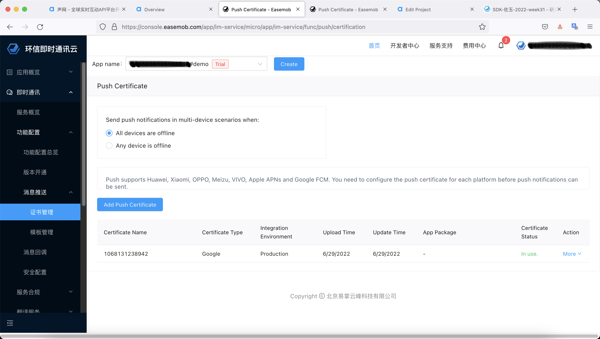
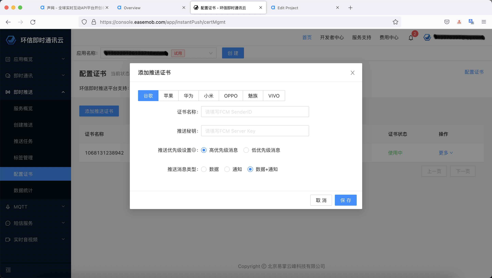
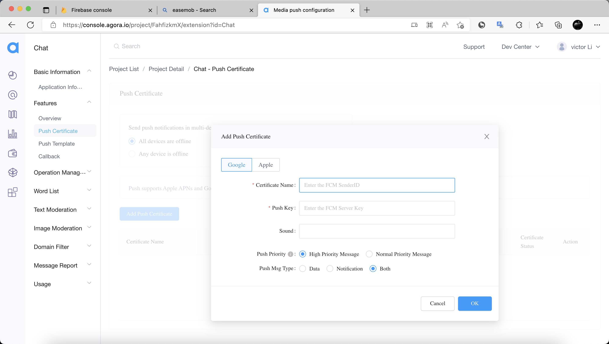
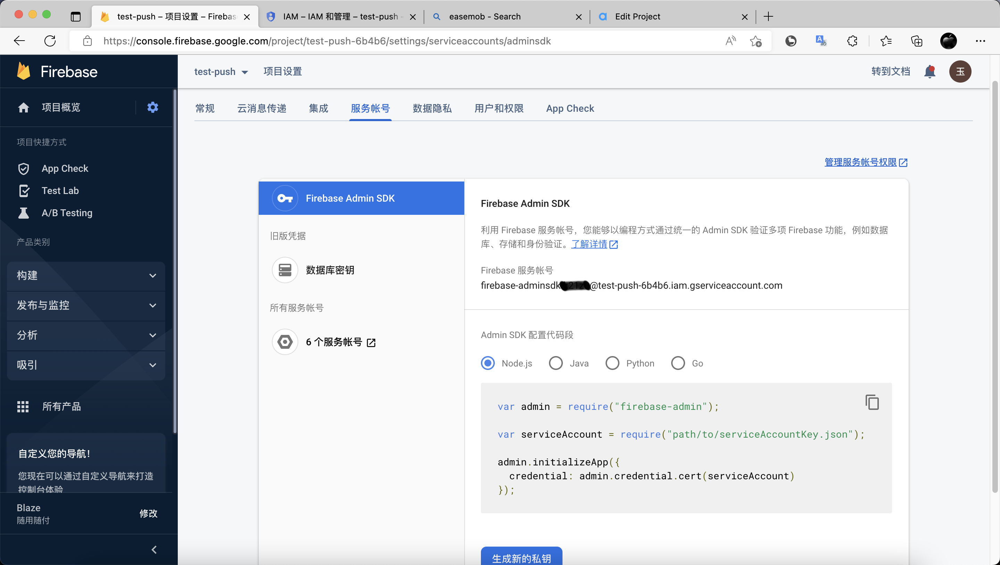
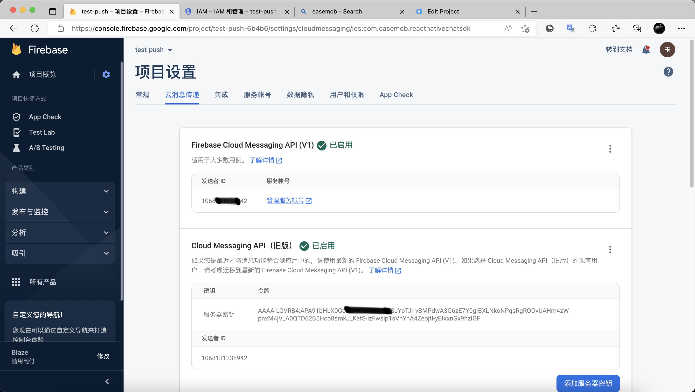
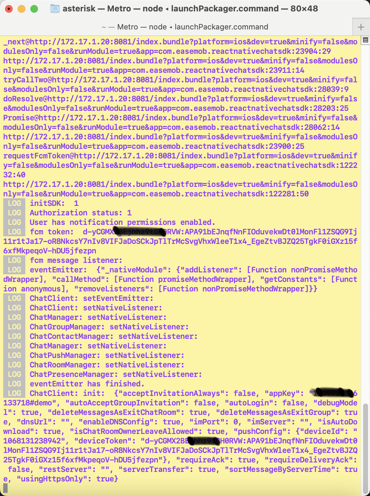
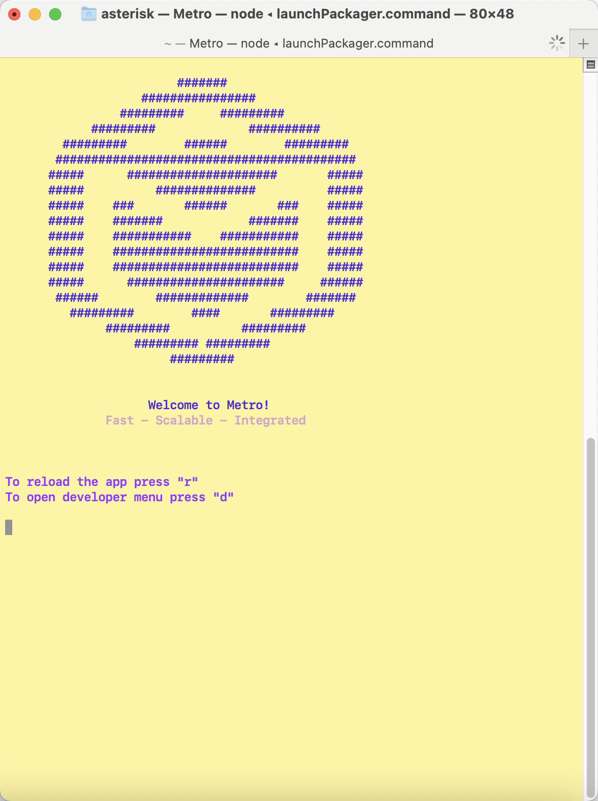
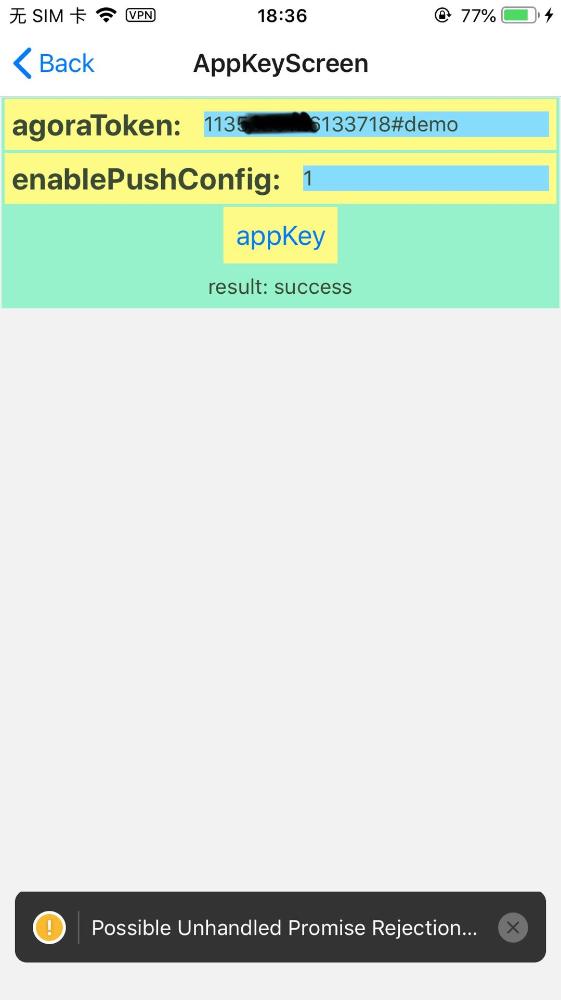

更新日期: 2022-08-15

# SDK 推送

## Demo 相关介绍

目前，React-Native 支持 `FCM` 推送，其它（apple、小米、华为、oppo、vivo、魅族），没有验证过。

### 可以收到推送的 必要条件

满足以下所有条件可以收到服务器推送通知：

- 接收方成功登录过
- 接收方传递 `SenderId` 和 `deviceToken` 给服务器
- 声网 或者 环信 控制台设置 正确
- FCM 控制台设置 正确
- 当前用户和服务器断开连接。以下情况发生断开连接
- - 集成 SDK 的 app 没有运行
- - ios 平台，在后台，app 没有启用 `fetch app` 和服务器连接超时 （不同版本表现不一致）
- - android 平台，在后台，app 和服务器连接超时（超时时间无法确定，android 设备种类太多，版本太多）

### 目前支持哪些推送设置功能

'setConversationSilentMode'：设置指定会话的推送设置
'removeConversationSilentMode'：移除指定会话的推送设置
'fetchConversationSilentMode'：获取指定会话的推送设置
'setSilentModeForAll'：设置所有消息的推送设置
'fetchSilentModeForAll'：获取所有消息的推送设置
'fetchSilentModeForConversations'：获取会话列表的推送设置
'setPreferredNotificationLanguage'：设置推送优先语言
'fetchPreferredNotificationLanguage'：获取推送优先语言

### FCM 推送需要哪些参数

SDK:

- SenderId
- DeviceToken

Easemob Console:

- 证书名称
- 推送秘钥
- 优先级
- 消息类型

Agora Console:

- Certificate Name
- Push Key
- Sound
- Priority
- Msg Type

### 如何开启推送

SDK:

- 初始化的时候设置 `ChatPushConfig`
- 主动调用接口 `ChatClient#updatePushConfig`

Easemob Console: 参考上一章节 **FCM 推送需要哪些参数**
Agora Console: 参考上一章节 **FCM 推送需要哪些参数**

### 如何设置推送相关配置

参考上一章节 **如何开启推送**。

### 如何查看推送结果

- 通过控制台日志。
- 通过界面日志。

## 控制台配置介绍

参考 **FCM 推送需要哪些参数**

### 声网控制台（优先）

启用 push 的操作流程:

- `Console -> Project Management -> Config -> Features -> Chat -> Features -> Overview -> Offline Message Push` , 该选项需要启用
- 启用 push 的位置: `Project List / Project Detail / Chat - Overview`
  证书配置:
- `Console -> Project Management -> Config -> Features -> Chat -> Features -> Push Certificate -> Add Push Certificate` , 在该对话框添加相关信息
- 证书配置的位置: `Project List / Project Detail / Chat - Push Certificate`
  参考下面截图。

### 环信控制台

启用 push 的操作流程: 配置证书就是启用？？？
证书配置: 为啥有俩页面？？？

- 证书配置的位置: `即时通讯 / 消息推送 / 证书管理`
- 证书配置的位置: `即时推送 / 配置证书`
  参考下面截图。

## FCM 控制台介绍

### 如何获取 `SenderId`

获取位置: `项目设置 / 发送者ID`

### 如何获取 `秘钥`

v1版本获取方法:
- 获取位置: `项目设置 / 云消息传递`
v2版本获取方法:
- 获取位置: `项目设置 / 服务账号`
  点击 `生成新的秘钥` 按钮，生成新的秘钥。

## 参考

[谷歌控制台](https://console.firebase.google.com/)
[环信控制台](https://console.easemob.com/index)
[声网控制台](https://console.agora.io/)

[环信推送配置](https://console.easemob.com/app/instantPush/certMgmt)
[声网推送配置](https://console.agora.io/project/FahfizkmX/extension?id=Chat)

## 附件

